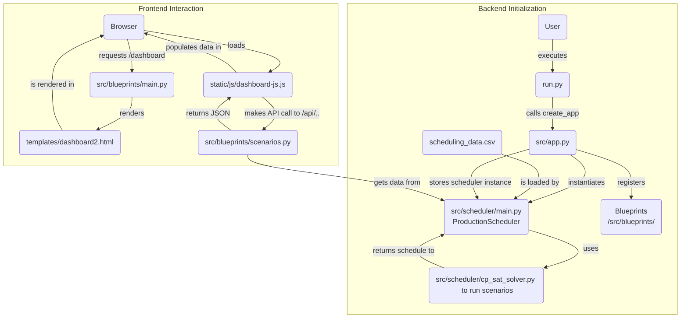

# Application Process Map

This document outlines the process flow of the application, from initialization to rendering the dashboard in the browser.

## Process Diagram

## Explanation

### Backend Initialization

This phase describes what happens when you start the application, before any user interacts with the web interface.

1.  **User -> `run.py`**: The entire process begins when you execute the `run.py` script from your terminal.
2.  **`run.py` -> `src/app.py`**: The `run.py` script's primary job is to call the `create_app` function located in `src/app.py`. This function builds and configures the main Flask web application.
3.  **`src/app.py` -> `ProductionScheduler`**: As part of the app creation, `src/app.py` creates an instance of the `ProductionScheduler` class, which is imported from `src/scheduler/main.py`. This object is the central hub for all scheduling logic.
4.  **`scheduling_data.csv` -> `ProductionScheduler`**: The `ProductionScheduler` immediately loads all the necessary data (tasks, products, teams, etc.) by reading the `scheduling_data.csv` file.
5.  **`ProductionScheduler` -> `CpSatScheduler`**: `src/app.py` then instructs the `ProductionScheduler` to run a series of initial scenarios. To do this, the scheduler delegates the complex task of finding an optimal schedule to the `CpSatScheduler` (from `src/scheduler/cp_sat_solver.py`).
6.  **`CpSatScheduler` -> `ProductionScheduler`**: The `CpSatScheduler` solves the scheduling problem and returns the results (the optimized schedule) back to the `ProductionScheduler`.
7.  **`ProductionScheduler` -> `src/app.py`**: The `ProductionScheduler`, now containing the results of the initial scenarios, is stored within the Flask application's context. This makes the data available to any part of the application that handles incoming requests.
8.  **Blueprints -> `src/app.py`**: Finally, `src/app.py` registers all the blueprints from the `src/blueprints/` directory. These blueprints define the application's URL routes, such as the main pages and the data APIs.

### Frontend Interaction

This phase describes what happens when a user accesses the dashboard in their web browser.

1.  **Browser -> `main.py` Blueprint**: A user opens their browser and navigates to the `/dashboard` URL. The request is handled by the appropriate route in `src/blueprints/main.py`.
2.  **`main.py` Blueprint -> `dashboard2.html`**: The handler function renders the `dashboard2.html` template and sends it back to the user's browser.
3.  **`dashboard2.html` -> Browser**: The browser displays the main HTML structure of the page.
4.  **Browser -> `dashboard-js.js`**: The HTML page contains a reference to `static/js/dashboard-js.js`, which the browser then requests and loads. This script handles the page's interactivity.
5.  **`dashboard-js.js` -> `scenarios.py` Blueprint**: The JavaScript executes an API call to an endpoint like `/api/scenario/baseline` to fetch the schedule data. This request is handled by a route in `src/blueprints/scenarios.py`.
6.  **`scenarios.py` Blueprint -> `ProductionScheduler`**: The API handler accesses the `ProductionScheduler` instance to get the cached scenario results.
7.  **`scenarios.py` Blueprint -> `dashboard-js.js`**: The blueprint returns the requested data to the browser as a JSON object.
8.  **`dashboard-js.js` -> Browser**: The JavaScript receives the JSON data and uses it to dynamically generate the charts and tables on the dashboard, which are then displayed to the user.

This flow allows the application to perform the heavy lifting of scheduling once at startup, and then serve the results quickly to any user who requests the dashboard.
